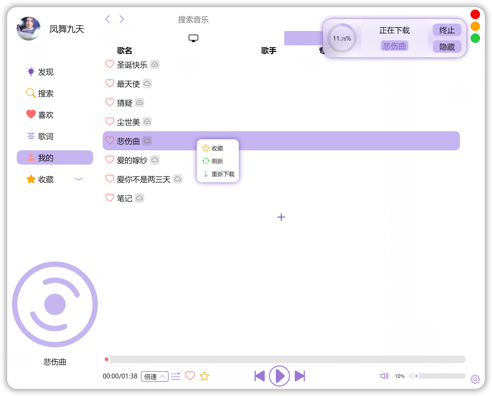

# 迷你音乐

### 特点
一个简单、美观的音乐播放器

### 版权
此项目仅用于代码学习和技术交流，不提供任何音乐下载或vip付费服务。请尊重音乐平台和创作者的版权，切勿做出任何损害音乐平台和创作者利益的行为。如若此项目无意侵犯了你的利益，请及时联系作者（1833608478@qq.com）,立即删除源代码。

所有歌曲数据均来源于网络，本项目几乎与你打开浏览器在线听音乐无异，仅仅只是节省了你打开网站搜索的时间而已。这里参考借鉴~~Ctrl CV~~了xtuJSer的项目[CoCoMusic](https://github.com/xtuJSer/CoCoMusic)中的数据接口。顺便提醒，数据接口随时可能失效，请提前做好心理准备。

### 安装包
Windows：    [mini-music-Setup-1.5.0.exe](https://gitee.com/cgper/miniMusic/attach_files/1048544/download/%E8%BF%B7%E4%BD%A0%E9%9F%B3%E4%B9%90%20Setup%201.5.0.exe)

Mac:         [mini-music-1.5.0.dmg](https://gitee.com/cgper/miniMusic/attach_files/1048542/download/%E8%BF%B7%E4%BD%A0%E9%9F%B3%E4%B9%90-1.5.0.dmg)

Linux:       [mini-music_1.4.0_amd64.deb](https://gitee.com/cgper/miniMusic/attach_files/761654/download/mini-music_1.4.0_amd64.deb)

Andriod（测试）：    [mini-music-1.1.0.apk](https://gitee.com/cgper/mini-music-mobile/attach_files/530445/download/mini-music-1.1.0.apk)

andriod 扫码下载：

### 截图
#### desktop版

#### 移动版

### 隐私
为了防止用户退出应用后丢失历史数据，本应用会记录你的一些使用习惯（包括历史搜索、mark的歌曲、音量大小）。但所有数据均会保存到本地浏览器（或app)的localStorage中储存，不会发送到网络而造成隐私泄漏。

若用户使用云端功能，歌单数据同步上传至用户gitee私有仓库，云端歌曲上传至用户gitee公共仓库。用户的账号等敏感数据会均会被加密储存，并且具备设备锁功能，即使知道密文也很难在其他电脑设备上解密。即使如此，仍需对用户进行风险告知：建议gitee账号上有重要的闭源或私有商业项目的用户谨慎使用云端功能。gitee账号权限较大，账号一旦泄漏，即使在不登陆gitee官网的情况下仍可以对账号所有仓库进行任意读写操作。

用户所有数据仅有用户自己和gitee能获取，没有任何其他第三方（包括此项目作者）能获取用户数据。用户可审查src/components/left_nav/login和src/network/gitee_api中的数据同步代码,或了解其中的工作原理。同时请务必保管好自己的gitee账户和密码。

### 提示

#### 数据同步
点击app左上角logo图标，登录gitee账号，可同步歌单和上传云端歌曲。首次登录会在用户gitee创建一个MiniMusicDatabase的私有仓库作为一个数据储存库和一个MiniMusicCloud的公共仓库作为云端音乐储存库。为不给gitee服务器造成负担，并未采用实时数据云同步。用户需手动同步歌单数据，故请一定注意上传数据到云端和下载云端数据到本地的逻辑先后顺序，以免造成“悲剧”（云端数据可通过gitee仓库提交记录找回）。由于gitee并未开放附件上传接口，故需用户前往release页面创建发行版后将歌曲作为附件上传(gitee限制仓库大小为1G)。应用会自动扫描上传的云端歌曲。

#### 快捷键
| 空格键   | ↑键  | ↓键 | ←键 | →键 |
|-------|------|-------|-------|--------|
| 暂停/播放 | 增加音量 | 减小音量  | 上一首   | 下一首    |

#### 窗口移动
此app为无边框应用，拖动窗口需在右侧40px宽的dragbar拖动区按住左键以拖动窗口，下图红色区：

#### Tips
- 本地音乐和云端音乐列表右键会显示更多隐藏的操作。
- 本地音乐和云端音乐仅支持mp3和wav等格式，其他格式请使用[音频格式转换](https://www.aconvert.com/cn/audio/)等工具转换为mp3格式后使用。
- 云端音乐不支持在线播放，首次播放需下载。
- 搜索列表右键可添加收藏，取消收藏需进入收藏页面点击歌曲前面的五角星。
- 歌曲列表点击歌手名，可进入歌手主页。

### 更新v1.5.0
- 新增本地音乐和云端音乐
- 新增更新通知
- 修复部分接口
- 优化UI

### 期待
- 更人性化的搜索历史和搜索历史云同步
- 当前播放列表
- 历史播放列表
- 个性化背景和高亮色设置
- 歌词小窗

### 说明
- Mac版由于安全限制缺失部分功能
- Linux版由于electron有bug，有些微差别

### 开发
#### desktop版
##### 安装开发依赖
> npm install
##### 调试
注意：安装完依赖后，将node_modules/axios/lib/adapters下http.js里的内容覆盖掉xhr.js里的内容
> npm run electron:serve
##### 打包（你使用哪个系统平台就会打包对应平台的安装包）
> npm run electron:build
#### 移动版
移动版和desktop版有着些许差别，请前往[迷你音乐移动版](https://gitee.com/cgper/mini-music-mobile)

### 致谢
[Vue.js](https://cn.vuejs.org/)

[electron](https://www.electronjs.org/)

[CoCoMusic](https://github.com/xtuJSer/CoCoMusic)

[vue-cli-plugin-electron-builder](https://github.com/nklayman/vue-cli-plugin-electron-builder)

[BootStrap Icons](https://icons.getbootstrap.com/)   感谢BootStrap Icons提供的开源图标

[100font](https://www.100font.com/)  感谢本项目中用到的免费商用字体

[node-music-api](https://github.com/lunhui1994/node-music-api) （ < v1.3.0）

[Element](https://element.eleme.cn/#/zh-CN)（ < v1.2.0）
